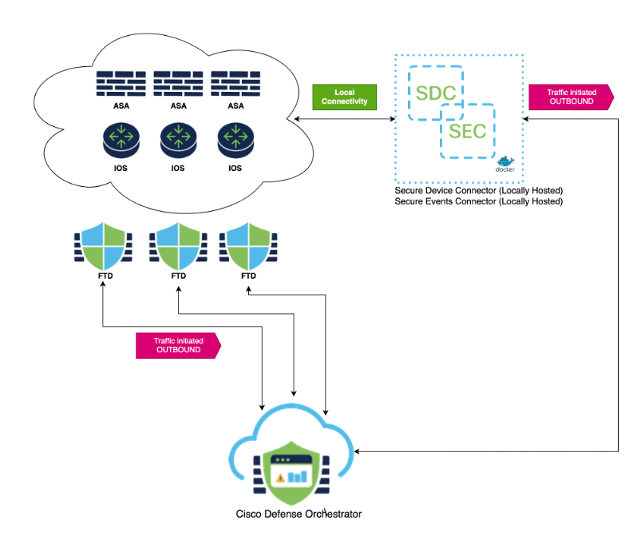

# Deploy CDO SDC/SEC Services

[](https://opensource.org/licenses/Apache-2.0)  

## Abstract
This project contains scripts to simply deploy the Cisco Defense Orchestrator (CDO) Secure Device Connector (SDC) and Secure Events Connector (SEC) on Linux Ubuntu systems. The scripts have been tested on Ubuntu 22.04 (jammy) and Ubuntu 20.04 (focal).   

While Cisco Defense Orchestrator does supply a Linux VMWare image that has a configuration wizard, docker, and the needed packages already installed for the SDC and SEC services, many organizations may desire to run these services on their own Linux system rather than use the pre-packaged VMWare image. The reasons are many, but may include:  the organization may not have a VMWare implementation, the organization has a requirement to use a specific Linux distro, the organization has an existing docker eco-system, there are organizational boundaries and challenges that make it difficult to deploy new VMWare instances, simple lab usage, etc. 

## System requirements
These scripts were written using Ubuntu 20.04 (focal) and 22.04 (jammy) as the test systems. Your milage may vary on older Ubuntu releases.  

### Ubuntu package requirements
- Docker Engine (Community Edition) See the README-DOCKER.md to use the docker install script provided.
- The deployment script will install the needed apt packages and their dependencies for deploying the SDC and SEC

### CPU/RAM Requirements
The resource requirements are for both bare-metal Ubuntu installations as well as virtual installations like VMWare, Nutanix, Cisco Modeling Labs, qemu, AWS, Azure, etc.  
- SDC Container Only  
  - CPU Requirement: 2 CPU Cores/vCPUs Minimum
  - RAM Requirement: 2 Gig Minimum
- SDC and Secure Events Connector (SEC) Containers  
  - CPU Requirement: 4 CPU Cores/vCPUs Minimum  
  - RAM Requirement: 8 Gig Minimum 

### Networking Requirements
- A static IP address or DHCP reservation on the Ubuntu server to ensure the Ubuntu system's IP address does not change
- An RFC-1918 ("Private") IP address on the Ubuntu server is fine
- Outbound Internet access on ports 80 and 443 ***TODO: Fact Check this***
- The Ubuntu server running the SDC container will need a network path to reach the management interfaces of the ASAs and IOS devices
- Devices that wish to log to the cloud will need a network path to the Ubuntu server running the SEC container
- See the `Tips and Tricks` section for iptables or firewalling considerations

## Quick Start TLDR;
**Note: Do NOT sudo or run as root!**
```
git clone xxxxx
cd xxxxx
./deploy_sdc.sh Q0RPX1RPS0VOPSJleU...Y29fYWFoYWNrbmUtU0RDLTQiCg==
```
Where `Q0RPX1RPS0VOPSJleU...Y29fYWFoYWNrbmUtU0RDLTQiCg==` is your SDC bootstrap data from the CDO portal.  

# Detailed Information
## What are the SDC and SEC containers?
### Secure Device Connector (SDC)
The SDC is a docker containerized service that facilitates communication between Cisco Defense Orchestrator and Cisco Adaptive Security Appliance (ASA/ASAv) firewalls (HTTPS) and Cisco IOS Routers/Switches (SSH) that are not cloud-native. Note that the Firewall Threat Defense platform (FTD) is CDO cloud native and does not require the use of an SDC to be managed by CDO and a cloud-delivered Firewall Management Center (cdFMC).  

### Secure Event Connector (SEC)
Once the SDC is deployed an SEC container is an easy add-on. The SEC service receives syslog messages from ASA, IOS, and FTD platforms and securely sends them to the Cisco cloud where eventing services like CDO Analytics and Cisco XDR can store, augment, and analyze these log messages.
<p align="center">

</p>  

## What does the deploy_sdc.sh script do?
While it's not necessary to know all of the detailed steps that the script executes to use the deploy script, we are providing the following details for the inquisitive or those that may want to adapt the script for some other Linux distro.  
  
Note that when running the script, the current user must be able to run `sudo` commands and will be prompted for their password when running the script, as there are `sudo` commands embedded as needed as part of the deploy script. As always, check the script's code in `deploy.sh` if there are concerns over the use of the sudo commands contained within.  
  
**Note: Do NOT sudo or run as root!**  
  
`deploy_sdc.sh` script:  
1. Checks to make sure the required apt packages are installed and installs them if they are not present.
2. Add a new user `sdc`. This is the user under which the SDC and SEC containers will run.
3. Creates the `sdc` user's home directory at `/usr/local/cdo`.
4. Add the `sdc` user to the `docker` user group to give the `sdc` user permissions to start and stop docker containers.
5. Adds the user running the script to the `docker` user group to give current user permissions to start and stop docker containers.
6. Checks that the `/etc/daemon.json` file exists. If the file does not exist, the script create it with some default settings. See the README-DOCKER.md file for more details.
7. Restarts the docker daemon and displays the docker daemon status. **Note**: If you have existing docker containers, this restart will impact them in the same way that any docker restart would.
8. Downloads a bespoke `bootstrap.sh` script as part of an archive from your specific CDO tenant and decompresses the archive in `/usr/local/cdo`.
9. Decodes the base64 bootstrap data provided as an argument to the `deploy_sdc.sh` script, exports the data as environment variables, and then passes the variables into the `bootstrap.sh` script, which is ran automatically.
10. The `bootstrap.sh` script pulls the required docker images from the CDO docker registry, configures the `sdc` user's crontab to keep the SDC and SEC containers updated as needed, and finally runs the docker containers, making the SDC active and available in CDO.

## How to run the deploy_sdc.sh script: Deploy the SDC container
### Clone this project and change into the project directory
```
git clone xxxxx
cd xxxxx
```
### Create an SDC in your CDO tenant
1. Log into your CDO Tenant and navigate to Tools & Services --> Secure Connectors
2. Click the blue (+) button and add a Secure Device Connector (SDC)
3. Copy the `SDC Bootstrap Data` to use as a CLI parameter for the script.

### Run the script
We will run the `deploy_sdc.sh` with the `SDC Bootstrap Data` that you copied from the CDO tenant portal as the only parameter for the script. Note that the `SDC Bootstrap Data` will wrap several lines in your terminal. This is fine and there is no need to try and split the data into smaller chunks.  
  
**Note: Do NOT sudo or run as root!**  
  
Example:
```
./deploy_sdc.sh Q0RPX1RPS0VOPSJleU...Y29fYWFoYWNrbmUtU0RDLTQiCg==
```

## Deploying the SEC container
Once the SDC is deployed, the bootstrap scripts needed to deploy an SEC are already present on your system.  

### Create an SEC in your CDO tenant
1. Log into your CDO Tenant and navigate to Tools & Services --> Secure Connectors
2. Click the blue (+) button and add a Secure Events Connector (SEC)
3. Copy the `SEC Bootstrap Data` to use in the bootstrap script (**Not the SDC Bootstrap Data!**)

### Run the SEC bootstrap script
1. "su" to the sdc user: `sudo su sdc`
2. Run the bootstrap script: `/usr/local/cdo/toolkit/sec.sh setup`
3. Paste the bootstrap data in when prompted

# Tips and Tricks
## Delete an SDC and SEC from your Ubuntu system
We have included a simple script to delete the SDC and SEC from the Linux system in the event one wishes to do so. The script `delete_sdc` will delete both the SDC and the SEC.
1. Deletes the sdc user's crontab
2. Stops and removes the SDC and SEC docker containers
3. Removes the SDC and SEC docker images from the system
4. Deletes the sdc user's home directory `/usr/local/cdo`
5. The script does NOT delete the sdc user and it would be up to the user to do so or to re-run the `deploy_sdc.sh` script again.


## iptables or other inbound/outbound rule filtering/firewalling
If you are filtering connections to and from your Ubuntu server, there are a few considerations to address for the SDC and SEC:
1. The SDC host linux system will need outbound `https` access to your ASA devices on whatever IP and port your ASAs have been configured to listen on. Typically, this is the ASA's management interface IP address on `TCP port 443`.
2. The SDC host linux system will need outbound `SSH` access to your IOS or other SSH integrations that you wish to manage from CDO. Typically, this will be some management IP on `TCP port 22`.
3. The SDC host linux system will need outbound access to the public Internet on 80/443 and the linux system would need some kind of `dns` name resolution as well as `ntp` services to keep the system clock in sync.
4. The SEC receives syslog and netflow data from ASA, IOS, and FTD devices. As such, there will need to be inbound access rules for the host linux system to receive these packets. By default, the SEC will listen on the following ports and protocols:
   -  Syslog UDP/10025
   -  Syslog TCP/10125
   -  Netflow TCP/10425
